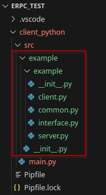
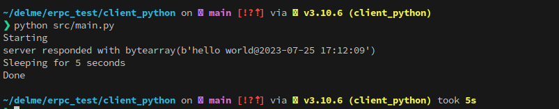

# C++ Server

ERPC C/C++ Source files at the moment are not generated by the makefile, they have to 
be manually generated prior to running `make`. 

The full list of commands to build the server is:

```bash
cd server_cpp
../Linux_x64/erpcgen -o build/generated/ src/example.erpc
make
```

To run the server:

```bash
cd <project root>
./server_cpp/build/apps/program 
```

# Python Client

First generate the Python client code using erpcgen again

```bash
cd client_python
../Linux_x64/erpcgen -o src/example -g py ../server_cpp/src/example.erpc
```

which will generate python code as follows (stuff in the red rectangle is generated):



Then enter the Python virtual environment, set PYTHONPATH and run the client application:

```bash
pipenv install # only if required
pipenv shell
export PYTHONPATH=${PWD}/src
python src/main.py
```

this should result in the following (server will obviously have to be running when doing this):




